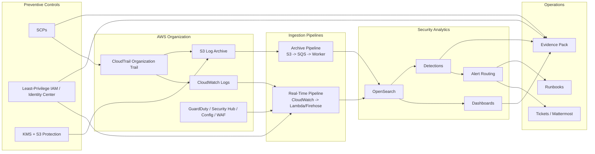

# Target Architecture

This document defines the architecture direction engineers should preserve as the repository grows.

## Design Principles

- CloudTrail is the source of truth for AWS control-plane activity.
- The log archive must be durable, encrypted, and tamper-resistant.
- Real-time and archive ingestion are complementary, not competing, paths.
- Security controls should be automated, reviewable, and testable.
- Every detection should map to an owner, an alert path, and a runbook.
- Every compliance-sensitive control should map to evidence.

## Target Security Architecture

## Security Domains In This Repo

### 1. Logging and Retention

- CloudTrail
- S3 archive and lifecycle
- CloudWatch log retention
- KMS protection
- Object Lock and versioning where feasible

### 2. Ingestion and Search

- real-time pipeline definitions
- archive replay and backfill
- OpenSearch cluster and index management
- field mapping and normalization

### 3. Detection and Response

- high-signal detections
- severity and routing policy
- triage and escalation runbooks
- incident response workflows

### 4. Compliance and Evidence

- control narratives
- evidence collection steps
- retention and access proof
- periodic review outputs

### 5. DevSecOps and Supply Chain Security

- CI/CD security gates
- image scanning
- IaC scanning and policy checks
- change-management traceability

## Recommended AWS Account Model

The reviewed program materials recommend moving toward clearer separation of duties with dedicated security accounts:

- `management`: governance and billing root
- `logging`: immutable centralized log archive
- `security-tooling`: SIEM, aggregation, detections, dashboards
- `audit`: read-only evidence and audit access

If the organization is not ready for all four immediately, engineers should still design changes so those responsibilities can be separated later without major rework.

## Required Control Patterns

- deny log tampering with SCPs and IAM controls
- encrypt compliance logs with customer-managed KMS keys
- prefer temporary role assumption over static credentials
- route alerts with context rich enough for responders to act immediately
- treat evidence generation as part of the design, not a later manual exercise

## Architectural Guardrails For Contributors

When adding new capabilities:

1. Decide which domain owns the change.
2. Place the code or documents in the domain folder that matches the control.
3. Add or update a runbook if the change affects incident response.
4. Add or update evidence guidance if the change affects compliance.
5. Avoid shortcuts that create hidden dependencies on one environment or one engineer.
